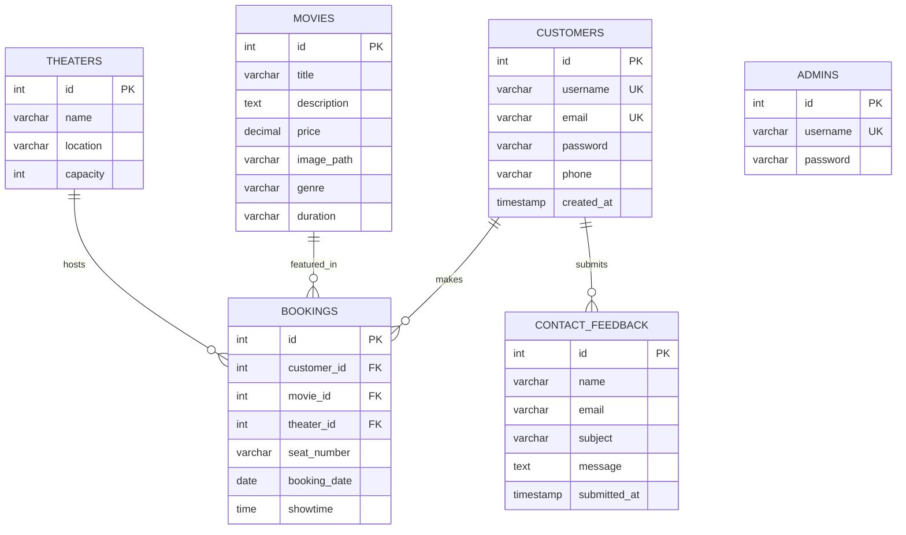

# 🎬 MovieLand - Online Movie Ticket Booking System

[](https://www.oracle.com/java/)
[](https://maven.apache.org/)
[](https://www.mysql.com/)
[](https://jakarta.ee/)
[](https://opensource.org/licenses/MIT)

> A comprehensive web-based movie ticket booking platform built with Java Servlets, JSP, and MySQL. Experience seamless movie browsing, seat selection, and secure online payments.

---

## 📋 Table of Contents

- [Features](#-features)
- [Tech Stack](#-tech-stack)
- [Architecture](#-architecture)
- [Installation](#-installation)
- [Usage](#-usage)
- [Project Structure](#-project-structure)
- [Database Schema](#-database-schema)
- [API Endpoints](#-api-endpoints)
- [Screenshots](#-screenshots)
- [Testing](#-testing)
- [License](#-license)
- [Contact](#-contact)

---

## ✨ Features

### 🎟️ User Features
- **Movie Browsing**: Browse latest and upcoming movies with detailed information
- **Advanced Search**: Search movies by title, genre, or duration
- **Seat Selection**: Interactive seat booking with real-time availability
- **Secure Payments**: Integrated payment gateway for ticket purchases
- **User Authentication**: Secure registration and login system
- **Theater Timetables**: View movie showtimes across multiple theaters
- **Feedback System**: Submit feedback and contact support
- **Responsive Design**: Mobile-friendly interface with smooth animations

### 🛡️ Admin Features
- **Movie Management**: Add, update, and delete movie entries
- **Theater Management**: Manage theater information and schedules
- **Dashboard**: Comprehensive admin panel for system oversight
- **Customer Feedback**: View and manage user feedback and inquiries

### 🔐 Security Features
- Session-based authentication
- SQL injection prevention
- Input validation and sanitization
- Role-based access control (User/Admin)

---

## 🛠️ Tech Stack

| Category | Technology |
|----------|------------|
| **Language** | Java 23 |
| **Web Framework** | Jakarta Servlets 6.1.0, JSP 3.0 |
| **Template Engine** | JSTL 3.0.2 |
| **Build Tool** | Maven 3.9+ |
| **Database** | MySQL 8.0.33 |
| **Server** | Apache Tomcat 10.1+ / Jakarta EE Compatible Server |
| **Frontend** | HTML5, CSS3, Vanilla JavaScript |
| **Email Service** | Jakarta Mail API 2.0.1 |
| **Testing** | JUnit 5.11.0 |

---

## 🏗️ Architecture

MovieLand follows the **MVC (Model-View-Controller)** architectural pattern with a layered architecture:

```
┌─────────────────────────────────────────┐
│         Presentation Layer (JSP)        │
│        (Views + Client-side JS)         │
└───────────────┬─────────────────────────┘
                │
┌───────────────▼─────────────────────────┐
│       Controller Layer (Servlets)       │
│   - Request Handling                    │
│   - Session Management                  │
│   - Response Generation                 │
└───────────────┬─────────────────────────┘
                │
┌───────────────▼─────────────────────────┐
│         Business Logic Layer            │
│   - DAO (Data Access Objects)           │
│   - DTOs (Data Transfer Objects)        │
└───────────────┬─────────────────────────┘
                │
┌───────────────▼─────────────────────────┐
│          Database Layer (MySQL)         │
│   - Movies, Users, Theaters, Bookings   │
└─────────────────────────────────────────┘
```

### Key Components

- **Controllers (Servlets)**: Handle HTTP requests and coordinate between view and model
- **DTOs**: Plain Java objects representing data entities (Movie, Customer, Theater, etc.)
- **DAOs**: Database access layer with CRUD operations
- **Views (JSP)**: Dynamic web pages with JSTL for server-side rendering
- **Database Connection**: Centralized DB connection management

---

## 🚀 Installation

### Prerequisites

Ensure you have the following installed:

| Software | Version | Download Link |
|----------|---------|---------------|
| JDK | 17+ (23 recommended) | [Oracle JDK](https://www.oracle.com/java/technologies/downloads/) |
| Maven | 3.9+ | [Apache Maven](https://maven.apache.org/download.cgi) |
| MySQL | 8.0+ | [MySQL Community](https://dev.mysql.com/downloads/) |
| Apache Tomcat | 10.1+ | [Apache Tomcat](https://tomcat.apache.org/download-10.cgi) |

### Setup Steps

1. **Clone the Repository**
   ```bash
   git clone https://github.com/WickramaarachchiBS/MovieLand-WebApp.git
   cd MovieLand-WebApp
   ```

2. **Configure MySQL Database**
   
   Create a new database:
   ```sql
   CREATE DATABASE movieland_db;
   USE movieland_db;
   ```

   Create necessary tables:
   ```sql
   -- Movies Table
   CREATE TABLE movies (
       id INT PRIMARY KEY AUTO_INCREMENT,
       title VARCHAR(255) NOT NULL,
       description TEXT,
       price DECIMAL(10,2),
       image_path VARCHAR(500),
       genre VARCHAR(100),
       duration VARCHAR(50)
   );

   -- Customers Table
   CREATE TABLE customers (
       id INT PRIMARY KEY AUTO_INCREMENT,
       username VARCHAR(100) UNIQUE NOT NULL,
       email VARCHAR(255) UNIQUE NOT NULL,
       password VARCHAR(255) NOT NULL,
       phone VARCHAR(20),
       created_at TIMESTAMP DEFAULT CURRENT_TIMESTAMP
   );

   -- Admins Table
   CREATE TABLE admins (
       id INT PRIMARY KEY AUTO_INCREMENT,
       username VARCHAR(100) UNIQUE NOT NULL,
       password VARCHAR(255) NOT NULL
   );

   -- Theaters Table
   CREATE TABLE theaters (
       id INT PRIMARY KEY AUTO_INCREMENT,
       name VARCHAR(255) NOT NULL,
       location VARCHAR(500),
       capacity INT
   );

   -- Bookings Table
   CREATE TABLE bookings (
       id INT PRIMARY KEY AUTO_INCREMENT,
       customer_id INT,
       movie_id INT,
       theater_id INT,
       seat_number VARCHAR(10),
       booking_date DATE,
       showtime TIME,
       FOREIGN KEY (customer_id) REFERENCES customers(id),
       FOREIGN KEY (movie_id) REFERENCES movies(id),
       FOREIGN KEY (theater_id) REFERENCES theaters(id)
   );

   -- Feedback Table
   CREATE TABLE contact_feedback (
       id INT PRIMARY KEY AUTO_INCREMENT,
       name VARCHAR(255),
       email VARCHAR(255),
       subject VARCHAR(500),
       message TEXT,
       submitted_at TIMESTAMP DEFAULT CURRENT_TIMESTAMP
   );
   ```

3. **Configure Database Connection**

   Update database credentials in `DBConnection.java`:
   ```java
   // src/main/java/org/example/demomerge/connection/DBConnection.java
   private static final String URL = "jdbc:mysql://localhost:3306/movieland_db";
   private static final String USER = "your_mysql_username";
   private static final String PASSWORD = "your_mysql_password";
   ```

4. **Build the Project**
   ```bash
   cd demoMerge
   mvn clean install
   ```

5. **Deploy to Tomcat**

   **Option A: Manual Deployment**
   - Copy `target/demoMerge-1.0-SNAPSHOT.war` to Tomcat's `webapps` directory
   - Start Tomcat: `./bin/startup.sh` (Linux/Mac) or `.\bin\startup.bat` (Windows)

   **Option B: IDE Deployment (IntelliJ IDEA)**
   - Open project in IntelliJ IDEA
   - Configure Tomcat server in Run/Debug Configurations
   - Deploy and run

6. **Access the Application**
   ```
   http://localhost:8080/demoMerge-1.0-SNAPSHOT/
   ```

---

## 💻 Usage

### User Workflow

1. **Registration/Login**
   - Navigate to `/register.jsp` to create a new account
   - Login at `/login.jsp` with credentials

2. **Browse Movies**
   - View latest and upcoming movies on the homepage
   - Click "See More" or access `/RetrieveAllMovieServlet` for complete catalog

3. **Book Tickets**
   - Select a movie → View details → Choose showtime
   - Select seats from interactive seat map
   - Proceed to payment and confirm booking

4. **Manage Profile**
   - View booking history
   - Update personal information
   - Submit feedback via contact form

### Admin Workflow

1. **Admin Login**
   - Access admin panel at `/admin_login.jsp`
   - Login with admin credentials

2. **Manage Movies**
   - Add new movies via `/AddMovieServlet`
   - Update existing movies at `/update_movie.jsp`
   - Delete movies using `/DeleteMovieServlet`

3. **View Analytics**
   - Dashboard overview of bookings and revenue
   - Customer feedback and inquiries

---

## 📁 Project Structure

```
MovieLand-WebApp/
│
├── demoMerge/                          # Main project directory
│   ├── src/
│   │   └── main/
│   │       ├── java/
│   │       │   └── org/example/demomerge/
│   │       │       ├── connection/
│   │       │       │   └── DBConnection.java          # Database connection utility
│   │       │       │
│   │       │       ├── controller/                    # Servlet Controllers
│   │       │       │   ├── LoginServlet.java
│   │       │       │   ├── RegisterServlet.java
│   │       │       │   ├── LogoutServlet.java
│   │       │       │   ├── AddMovieServlet.java
│   │       │       │   ├── UpdateMovieServlet.java
│   │       │       │   ├── DeleteMovieServlet.java
│   │       │       │   ├── RetrieveAllMovieServlet.java
│   │       │       │   ├── MovieDetailServlet.java
│   │       │       │   ├── SeatBookingServlet.java
│   │       │       │   ├── PaymentServlet.java
│   │       │       │   ├── TimetableServlet.java
│   │       │       │   ├── FeedbackServlet.java
│   │       │       │   ├── ContactUsServlet.java
│   │       │       │   ├── AdminLoginServlet.java
│   │       │       │   └── RetrieveAdminMovieServlet.java
│   │       │       │
│   │       │       ├── dao/                           # Data Access Layer
│   │       │       │   ├── CustomerDAO.java           # Customer CRUD operations
│   │       │       │   ├── MovieDAO.java              # Movie CRUD operations
│   │       │       │   ├── TheaterDAO.java            # Theater CRUD operations
│   │       │       │   ├── AdminDAO.java              # Admin operations
│   │       │       │   └── ConFeedDAO.java            # Feedback operations
│   │       │       │
│   │       │       └── dto/                           # Data Transfer Objects
│   │       │           ├── Customer.java              # Customer model
│   │       │           ├── Movie.java                 # Movie model
│   │       │           ├── Theater.java               # Theater model
│   │       │           └── Contact_Feedback.java      # Feedback model
│   │       │
│   │       └── webapp/                                # Web Resources
│   │           ├── WEB-INF/
│   │           │   └── web.xml                        # Deployment descriptor
│   │           │
│   │           ├── Assets/                            # Static resources
│   │           │   ├── script.js                      # Client-side JavaScript
│   │           │   ├── homepageImages/                # Movie posters & banners
│   │           │   └── letter-m.png                   # Favicon
│   │           │
│   │           ├── CSS/                               # Stylesheets
│   │           │   ├── style.css                      # Main styles
│   │           │   ├── admin.css                      # Admin panel styles
│   │           │   ├── payment.css                    # Payment page styles
│   │           │   └── pay_confirm.css                # Confirmation page styles
│   │           │
│   │           └── JSP Pages/
│   │               ├── index.jsp                      # Homepage
│   │               ├── login.jsp                      # User login
│   │               ├── register.jsp                   # User registration
│   │               ├── all_movie.jsp                  # Movie catalog
│   │               ├── single_movie.jsp               # Movie details
│   │               ├── seat_selection.jsp             # Seat booking
│   │               ├── payment.jsp                    # Payment gateway
│   │               ├── pay_confirm.jsp                # Booking confirmation
│   │               ├── timetable.jsp                  # Show timings
│   │               ├── locations.jsp                  # Theater locations
│   │               ├── contact_us.jsp                 # Contact form
│   │               ├── feedback.jsp                   # Feedback form
│   │               ├── about_us.jsp                   # About page
│   │               ├── admin_login.jsp                # Admin login
│   │               ├── admin.jsp                      # Admin dashboard
│   │               ├── update_movie.jsp               # Movie update form
│   │               ├── navbar.jsp                     # Navigation component
│   │               └── footer.jsp                     # Footer component
│   │
│   ├── pom.xml                                        # Maven dependencies
│   ├── mvnw                                           # Maven wrapper (Unix)
│   └── mvnw.cmd                                       # Maven wrapper (Windows)
│
└── README.md                                          # This file
```

---

## 🗄️ Database Schema

### Entity Relationship Overview



### Table Descriptions

| Table | Description | Key Relationships |
|-------|-------------|-------------------|
| `customers` | User account information | → bookings, contact_feedback |
| `movies` | Movie catalog with details | → bookings |
| `theaters` | Theater locations and info | → bookings |
| `bookings` | Ticket reservations | ← customers, movies, theaters |
| `contact_feedback` | User communications | ← customers |
| `admins` | Administrative users | - |

---

## 🌐 API Endpoints

### User Endpoints

| Method | Endpoint | Description | Parameters |
|--------|----------|-------------|------------|
| GET | `/index.jsp` | Homepage with featured movies | - |
| POST | `/RegisterServlet` | User registration | username, email, password, phone |
| POST | `/LoginServlet` | User login | username, password |
| GET | `/LogoutServlet` | User logout | - |
| GET | `/RetrieveAllMovieServlet` | Fetch all movies | - |
| GET | `/MovieDetailServlet` | Get movie details | movieId |
| POST | `/SeatBookingServlet` | Book seats | movieId, theaterId, seats[], showtime |
| POST | `/PaymentServlet` | Process payment | bookingId, paymentMethod, cardDetails |
| GET | `/TimetableServlet` | View showtimes | theaterId, date |
| POST | `/FeedbackServlet` | Submit feedback | name, email, message |
| POST | `/ContactUsServlet` | Contact support | name, email, subject, message |

### Admin Endpoints

| Method | Endpoint | Description | Parameters |
|--------|----------|-------------|------------|
| POST | `/AdminLoginServlet` | Admin login | username, password |
| GET | `/admin.jsp` | Admin dashboard | - |
| POST | `/AddMovieServlet` | Add new movie | title, description, price, genre, duration, image |
| POST | `/UpdateMovieServlet` | Update movie | movieId, [updated fields] |
| POST | `/DeleteMovieServlet` | Delete movie | movieId |
| GET | `/RetrieveAdminMovieServlet` | Manage movies list | - |

---

<!-- ## 📸 Screenshots

### User Interface

<table>
  <tr>
    <td align="center">
      
      <br />
      <sub><b>Homepage - Hero Carousel</b></sub>
    </td>
    <td align="center">
      
      <br />
      <sub><b>Movie Catalog</b></sub>
    </td>
  </tr>
  <tr>
    <td align="center">
      
      <br />
      <sub><b>Interactive Seat Selection</b></sub>
    </td>
    <td align="center">
      
      <br />
      <sub><b>Secure Payment Gateway</b></sub>
    </td>
  </tr>
</table>

### Admin Panel

<table>
  <tr>
    <td align="center">
      
      <br />
      <sub><b>Admin Dashboard</b></sub>
    </td>
    <td align="center">
      
      <br />
      <sub><b>Movie Management</b></sub>
    </td>
  </tr>
</table> 

> **Note**: Screenshots are for demonstration purposes. Create a `docs/screenshots/` directory and add actual screenshots.-->

---

## 🧪 Testing

### Running Tests

Execute unit tests with Maven:

```bash
cd demoMerge
mvn test
```

### Test Coverage

The project includes JUnit 5 tests for:
- ✅ DAO layer operations (CRUD)
- ✅ DTO validation
- ✅ Database connection handling
- ✅ Servlet request/response handling (planned)

### Manual Testing Checklist

- [ ] User registration with valid/invalid data
- [ ] Login/logout functionality
- [ ] Movie browsing and search
- [ ] Seat selection and booking flow
- [ ] Payment processing
- [ ] Admin CRUD operations
- [ ] Responsive design on mobile devices
- [ ] Cross-browser compatibility (Chrome, Firefox, Safari)

---

## 📄 License

This project is licensed under the **MIT License** - see the [LICENSE](LICENSE) file for details.

```
MIT License

Copyright (c) 2026 MovieLand Development Team

Permission is hereby granted, free of charge, to any person obtaining a copy
of this software and associated documentation files (the "Software"), to deal
in the Software without restriction, including without limitation the rights
to use, copy, modify, merge, publish, distribute, sublicense, and/or sell
copies of the Software, and to permit persons to whom the Software is
furnished to do so, subject to the following conditions:

The above copyright notice and this permission notice shall be included in all
copies or substantial portions of the Software.

THE SOFTWARE IS PROVIDED "AS IS", WITHOUT WARRANTY OF ANY KIND, EXPRESS OR
IMPLIED, INCLUDING BUT NOT LIMITED TO THE WARRANTIES OF MERCHANTABILITY,
FITNESS FOR A PARTICULAR PURPOSE AND NONINFRINGEMENT. IN NO EVENT SHALL THE
AUTHORS OR COPYRIGHT HOLDERS BE LIABLE FOR ANY CLAIM, DAMAGES OR OTHER
LIABILITY, WHETHER IN AN ACTION OF CONTRACT, TORT OR OTHERWISE, ARISING FROM,
OUT OF OR IN CONNECTION WITH THE SOFTWARE OR THE USE OR OTHER DEALINGS IN THE
SOFTWARE.
```
---

<div align="center">

**⭐ If you find this project helpful, please give it a star!**


</div>
